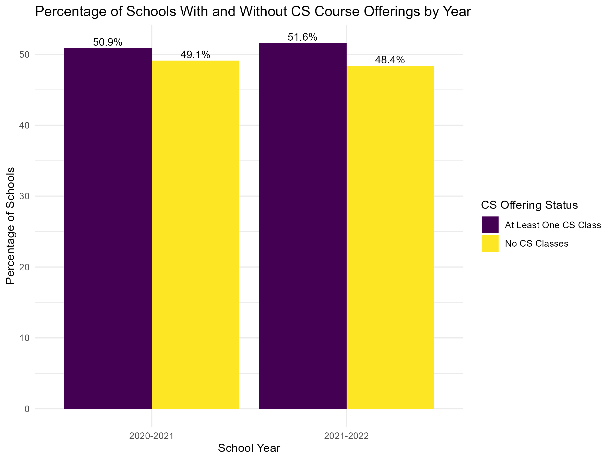

# K–12 Computer Science Course Offerings in the United States: A Descriptive Analysis (2020–2022)

This repository contains the descriptive analyses and visualizations used to characterize K–12 public schools included in the study of Computer Science (CS) course offerings during the 2020–2021 and 2021–2022 school years.

The analyses summarize the distribution of CS course offerings, school characteristics, student demographics, and geographic representation, providing a comprehensive overview of the study sample prior to inferential modeling. The analyses are based on the cleaned dataset produced in the companion repository: https://github.com/osomoai/k12-cs-course-pipeline-analysis

**Author:** Omodolapo Ojo, PhD  

---

**For further details, you can access other [Tables](Tables/) and [Figures](Figures/) in the directories.**

---

## Focus
This repository addresses the following descriptive questions:
1. **What are the characteristics of the shortlisted schools and the distribution of CS course offerings across the 2020–2021 and 2021–2022 school years?**
2. **What are the demographic and institutional characteristics of the shortlisted schools (e.g., gender, race/ethnicity, Title I status, juvenile justice status, and grade level) across the two school years?**
3. **How are the shortlisted schools geographically distributed across U.S. states during the 2020–2021 and 2021–2022 school years?**
4. **Among schools with different Title I classifications, what proportion offer at least one CS course versus no CS courses, and does this pattern differ across school years?**
5. **Among elementary, middle, and high schools, what proportion offer at least one CS course versus no CS courses, and does this pattern differ across school years?**
6. **Among juvenile justice and non-juvenile justice schools, what proportion offer at least one CS course versus no CS courses, and does this pattern differ across school years?**
7. **Among students of different racial and ethnic groups, what proportion are enrolled in schools with versus without CS course offerings across school years?**
8. **Among female and male students, what proportion are enrolled in schools with versus without CS course offerings across school years?**
9. **Among schools within each U.S. state, what proportion offer at least one CS course versus no CS courses, and how does this pattern vary across the 2020–2021 and 2021–2022 school years?**

---

## Synopsis of Findings

Descriptive analyses of the shortlisted U.S. schools showed that approximately half of schools offered at least one computer science (CS) course (50.9%), while the remaining schools reported no CS course offerings. Among schools with CS offerings, the average number of courses offered was approximately three courses, although substantial variation existed across schools.

CS availability differed across institutional characteristics. High schools had the highest proportion of CS offerings, with approximately 51% offering at least one CS course, compared with 38% of middle schools and 32% of elementary schools. CS availability was substantially lower among juvenile justice schools, where only approximately 6–7% offered at least one CS course compared with approximately 52% of non-juvenile justice schools. Differences were also observed across Title I classifications, with Targeted Assistance schools (~59%) and non-Title I schools (~55–56%) showing higher CS availability than Schoolwide Title I schools (~48–49%) and Mixed Title I schools (~38–44%).

Student enrollment patterns showed that approximately 71–73% of students attended schools offering at least one CS course, with minimal differences between female and male students. Access varied across racial and ethnic groups: students identifying as Asian had the highest proportion enrolled in schools offering CS courses (~81%), while American Indian students had the lowest (~58–59%). Hispanic, Black, White, and Multiracial students were enrolled in schools with CS offerings at rates ranging from approximately 67% to 75%. These findings describe differences in enrollment at schools with CS opportunities and do not represent differences in students' likelihood of taking CS courses.

Geographic variation in CS availability was substantial. Several states had relatively high proportions of schools offering at least one CS course, including Nebraska (87.6% in 2020–2021; 76.9% in 2021–2022), Iowa (83.5%; 86.5%), South Carolina (82.6%; 80.7%), Maryland (78.1%; 80.5%), Connecticut (72.3%; 77.0%), and Virginia (78.4%; 75.2%). In contrast, lower CS availability was observed in states such as Alaska (24.3%; 19.9%), Florida (22.0%; 22.1%), Minnesota (27.5%; 25.3%), and Washington (32.7%; 39.4%). These patterns indicate substantial geographic differences in school-level CS availability across the United States.

These findings summarize observed descriptive patterns and do not determine whether differences are statistically significant or independently associated with CS availability. The companion inferential analysis repository https://github.com/osomoai/multilevel-cs-access-analysis evaluates these relationships using a multilevel zero-inflated negative binomial modeling approach.

---

## Summary Tables

| Table | Description |
|-------|-------------|
| [Table 1: Shortlisted Schools](Tables/tab1_school_summary.csv) | Summary of shortlisted schools across U.S. states |
| [Table 2: School Characteristics](Tables/tab2_school_characteristics.csv) |Summary statistics of shortlisted schools across U.S. states |
| [Table 3: School Characteristics based on CS Offering](Tables/tab3_school_distribution.csv) |Summary statistics of shortlisted schools based on CS Offerings |
| [Table 4: Gender Distribution](Tables/tab4_gender_year.csv) | Gender across shortlisted schools |
| [Table 5: CS Offfering by Gender](Tables/tab5_gender_year_cs.csv) | Distribution of gender based on CS offering |
| [Table 6: Race/Ethnicity Distribution](Tables/tab6_race_year.csv) | Race/ethnicity across shortlisted schools |
| [Table 7: CS Offering by Race/Ethnicity](Tables/tab7_race_year_cs.csv) | Distribution of race/ethnicity based on CS offering |     
| [Table 8: Title 1 status of schools](Tables/tab8_title1_year.csv) |Title 1 status across shortlisted schools |
| [Table 9: CS Offering by Title 1 status](Tables/tab9_title1_year_cs.csv) |Distribution of Title 1 status based on CS offering |
| [Table 10: Juvenile vs Non-juvenile schools](Tables/tab10_juvenile_year.csv) | Juvenile status across shortlisted schools |
| [Table 11: CS Offering Juvenile vs Non-juvenile schools](Tables/tab11_juvenile_cs.csv) | Distribution of juvenile status based on CS offering |
| [Table 12: Grade-level of schools](Tables/tab12_grade_year.csv) | Grade levels across shortlisted schools  |
| [Table 13: CS Offering by Grade-levels](Tables/tab13_grade_year_cs.csv) | CS offering based on grade levels of schools |     
| [Table 14: Dsitribution of states of shortlisted schools](Tables/Table14_State_Distribution.csv) | List of states of shortlisted schools|
| [Table 15: CS Offering by States Across the U.S.](Tables/tab15_state_cs.csv) | CS offering based on states |     

---

## Visualizations

| Figure | Description |
|--------|-------------|
| [Figure 1: Distribution of CS Course Offerings](Figures/fig1_distribution.png) | Histogram of CS classes offered across schools by school year |
| [Figure 2: Schools With and Without CS Offerings](Figures/fig2_cs_status.png) | Percentage of schools with and without CS course offerings |
| [Figure 3: CS Offering by Gender](Figures/fig3_gender_cs.png) | CS offering status by student gender |
| [Figure 4: CS Offering by Race/Ethnicity](Figures/fig4_race_cs.png) | CS offering status by race/ethnicity |
| [Figure 5: CS Offering by Title I Status](Figures/fig5_title1_cs.png) | CS offering status by Title I classification |
| [Figure 6: CS Offering by Race/Ethnicity](Figures/fig6_juvenile_cs.png) | CS offering juvenile schools |
| [Figure 7: CS Offering by Title I Status](Figures/fig7_grade_cs.png) | CS offering status by grade levels |
| [Figure 8: Geographic Distribution of Schools](Figures/fig8_state_distribution.png) | Distribution of shortlisted schools across U.S. states |
| [Figure 9: Geographic Distribution of Schools](Figures/fig9_state_cs.png) | Distribution of schools based on CS courses offerings |
